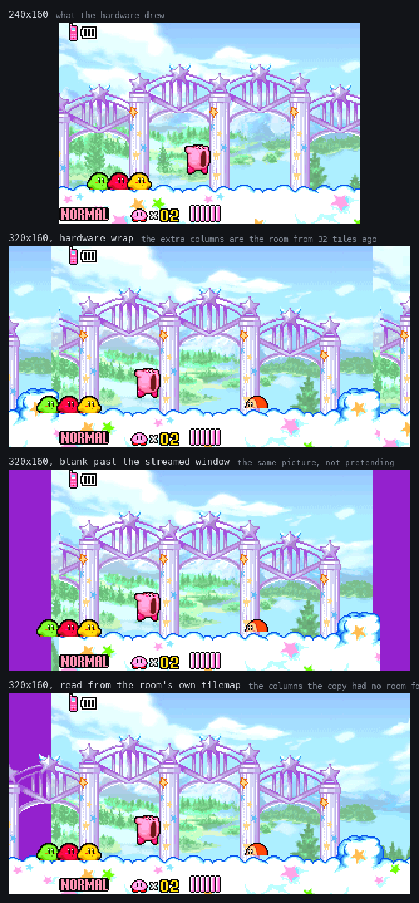
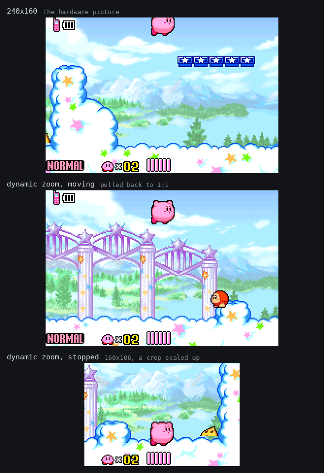
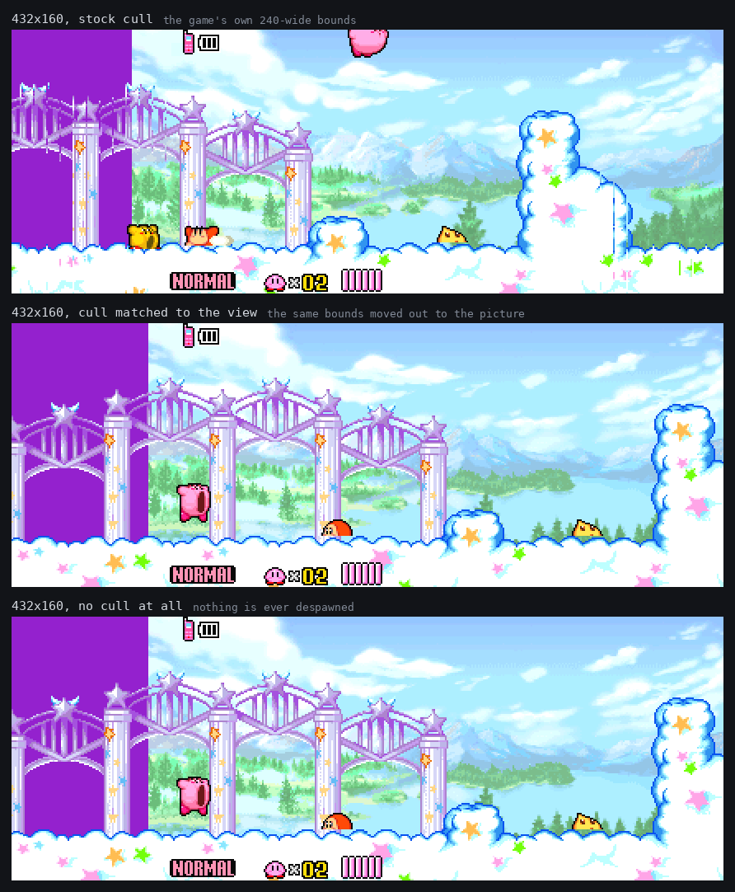

# The view: widescreen and a zooming camera

An experiment on the `quality-of-life` branch. The normal 240x160 presentation
is still the default and still what `master` ships; everything here is behind a
runtime switch on the page, under **Picture**.

The short version:

| | verdict |
|---|---|
| **Dynamic zoom** (crop and scale up) | works, costs less than the normal picture, and is the only mode here a player would ask for by name |
| **Widescreen** | works, but only because the software renderer can read level data the hardware could not, and it still shows the void beside a room at the room's own edges |
| **Widening the object cull to match** | correct and nearly free, and almost never necessary — the game already keeps objects alive 48 pixels past every edge |
| **Switching the cull off** | no observed benefit over widening it, and a plausible way to corrupt memory. Not recommended, kept as a control |

## What "240x160" turns out to mean

The number is written into five unrelated places, and they only look like one
number because on hardware they always agreed:

1. how many columns the display scans — `platform/ppu.c`
2. how far out an object is still written to OAM — `src/sprite_2.c`, four sites
3. how far out an object is still alive — `src/kirby.c`, three copies of one test
4. how far out an object is created at all — `src/code_080023A4.c`
5. how close to a room's edge the camera may get — `src/code_080023A4.c`

Widen (1) alone and you get a picture of everything the game believes is
off-screen: no enemies, because (4) never made them; nothing drawn, because (2)
rejects it; things winking out mid-stride, because (3) kills them; and the void
beside the room, because (5) stops the camera with 240 pixels inside it and
lets the rest hang over the edge.

`platform/view.c` derives all five from one description of the view.
`tools/portify.py` replaces the literals at (2)–(5) with globals that default
to exactly the constants they replaced, so a build that never leaves the
default view is the build that shipped. A pattern that stops matching is
reported by the sync, not skipped — half-widened bounds would give a picture
that is subtly wrong with nothing to attribute it to.

## Widescreen



The hard part was not the culling. It was the tilemap, and it nearly ended the
experiment.

`src/bg.c`'s `sub_08153184` refills a 32x32 screen block with the 32 map
columns starting at the camera, every time the camera crosses a tile boundary.
Thirty-two columns is 256 pixels for a 240-pixel screen, and `BG3HOFS` is the
low three bits of the scroll — so between 249 and 256 pixels of the room layer
are valid at any moment and the rest of the block holds the columns from 32
tiles ago. There is no spare video memory to give it a wider block: 0x0000 to
0xC000 is tile data, 0xC000 to 0x10000 the four map blocks in use, 0x10000 up
the sprite sheet.

So a naive widening shows **the room from 32 tiles ago, repeated** (second
panel). It is not obvious in a screenshot of a repetitive room, which is
exactly why it is worth a picture: the middle 240 columns are pixel-identical
to the hardware's, and the rest is fiction. The third panel is the same
picture with the fiction removed, and it shows how little of an 80-pixel
margin was ever real — about eight pixels on the right and none on the left.

On hardware that would be the end of it. It is not the end of it here, because
**the copy has an original**. The room's real tilemap is a plain row-major
array of the same 16-bit entries — decompressed into EWRAM at room load — and
the refill is a straight `DmaCopy16` out of it with no transformation at all:
no palette bias, no tile-index bias, nothing. The 32-column limit is the
hardware's, not the data's. A software renderer can read the entry the DMA
would have written had there been room for it, and everything downstream — the
flip bits, the palette bank, the tile fetch — is unchanged. The tile *pixels*
are already resident, because the tileset is uploaded whole at room load and
the animation path rewrites character data in place without ever touching a
map entry, so a synthesised column even animates correctly.

That is the fourth panel, and it is the real room.

### What is still wrong with it

- **A room's own edge.** Beside a room there is genuinely nothing, and the
  picture says so — the purple bars in the figures are the backdrop colour, a
  colour the hardware never shows because nothing ever scanned there. The
  camera clamp is padded so a wider view stops further inside the room, but
  the rectangle the camera obeys is not always the map's extent, so this still
  happens at room boundaries.
- **Sprite positions are nine bits.** OAM holds X in -256..255 and Y in
  -128..127. Past that the game cannot say where an object is however wide the
  picture gets, so the view is capped at +96 pixels a side.
- **Lines above and below the screen** are drawn from the register state at the
  two ends of the frame, because the game's per-scanline effects only exist for
  lines the display had. Right for a gradient, wrong for anything that happens
  only mid-frame.
- **Windows.** `WIN0`/`WIN1` are written in 240-wide coordinates. A boundary
  sitting on the screen's own edge is moved out to the view's, on the grounds
  that an edge means an edge; a boundary short of it is left alone.

### The HUD

It is on BG1, screen block 28, with both scroll registers held at zero for the
whole level — so it is in screen space, and widening the view slides it inwards
and wraps the 32-tile map round to repeat its own tiles beyond it.

The obvious answer is to cut it down the middle and pin each half to its own
edge. That is right for a HUD built out of corners and wrong for this one:
KATAM's is a continuous strip along the bottom — ability name at tile 0, lives
at tile 10, health bar from tile 13 rightwards — and a split at tile 15 tears
the health bar in two. So horizontally the HUD **floats**: drawn at its own
size, centred in the picture, blank outside.

Vertically it is **pinned**, always, and the asymmetry is the point. Down the
screen the HUD is two strips with nothing between them, and floating it centres
a 160-tall HUD inside a 106-tall crop and throws the bottom strip away
entirely. The pin toggle on the page is horizontal only, and it is there mostly
so the failure can be seen.

## The zooming camera



Two approaches were possible. *Render more* inherits every problem above.
*Crop and scale* shows only what the GBA showed — which makes zooming out
worthless and zooming in exact. Zooming in is the one people want, so the crop
won.

It is not the framebuffer being scaled: the PPU renders the smaller rectangle
directly and the page scales it, which means the mode costs **less** than the
normal picture rather than more.

"Dynamic" reacts to the camera's speed, not Kirby's. The platform layer does
not have to know what Kirby is to see how fast the world is moving past; the
camera is already smoothed by the game's own slew limit; and it stops dead at a
room edge, which is exactly where the extra magnification is welcome and where
Kirby's own velocity would still read "running". Enemy proximity was the other
candidate and is worse: it zooms out during a fight, which is when the player
is looking hard at a small area and a moving camera is an active nuisance.

Standing still eases in to 1.5x over about a second and a half; moving pulls
back to 1:1 in about a fifth of one. Asymmetric on purpose — arriving somewhere
and having the camera drift in is pleasant, being zoomed in one frame after you
start running is not.

The crop follows Kirby's position on screen rather than the screen's centre,
clamped so it never leaves the 240x160 the display actually produced. Centring
it is wrong at a room's edge, where the camera has stopped and Kirby keeps
walking: he can end up 120 pixels from the middle of the picture, and a crop
half that wide loses him.

One thing is genuinely lost: at 160 pixels wide the ability name at the left of
the HUD does not fit, and floating the HUD drops it. A 240-wide HUD does not go
into a 160-wide picture and no arrangement makes it.

## The culling



Three variants were compared: the stock bounds, the same bounds widened to
match the view, and no cull at all.

**The stock bounds already cover a modest widescreen.** The despawn test allows
±168 pixels horizontally and ±128 vertically from the centre of the 240x160
window — 48 pixels beyond every edge — and the spawn window is [camX-48,
camX+288). So at 320 wide the three variants are visually indistinguishable,
which is why the figure above is at 432: the difference only exists once the
picture outruns the margin the game was already keeping.

**Widening is the right variant, not disabling.** Two reasons, both checked:

- The game does not use destruction only to save time. Objects reset by being
  destroyed and rebuilt when the camera comes back, and the one-shot bitfield
  that remembers which chest has been opened is written by a task's
  *destructor* (`sub_0811BEBC`). Take destruction away and that machinery stops
  running.
- Every spawned object takes a node from `LevelInfo.unk1F0.nodes`, which is 64
  entries, and the allocator is `for (;;) { if (!var0->unk0C) return var0;
  var0++; }` — no bound, no failure return. Past the 64th it hands out a
  pointer into the fields that follow in the same struct: `currentRoom`, then
  the room's flag arrays. The struct sits at a fixed linker address with three
  more players packed behind it, so it cannot be made bigger either. Widening
  the window is bounded by the view; switching the cull off is bounded by the
  size of the room.

That second one is a described failure, not an observed one: 4000 frames with
no cull did not provoke it, because a scripted run walks into a wall and stops
spawning. It is the reason not to ship the option, not a reason to remove it —
the switch is on the page so the claim can be tested by someone who can reach a
big room.

## Cost

1200 frames of the same scripted run, under node, on this machine. The number
that matters is the ratio, not the absolute.

| mode | fps |
|---|---|
| native 240x160 | 159 |
| dynamic zoom | 188 |
| wide 320x160 | 121 |
| wide 320x160, cull matched | 128 |
| wide 320x160, no cull | 132 |
| wide 480x160 | 115 |

Widescreen costs about a quarter of the frame budget at 320 and a third at 480,
and it is all renderer: the cull variants differ by less than the noise between
runs, and the two that do more work came out faster than the one that does
less. Zoom is 18% cheaper than native because it renders fewer pixels.

In a browser all six modes hold 60 fps on a desktop. The 121 fps figure means a
phone that manages 60 today has roughly a 2x margin and would keep it at 320
wide; that is a prediction from a desktop measurement, not a measurement.

## Recommendation

**Take the dynamic zoom to `master`.** It cannot show anything the hardware did
not, it costs less than the picture it replaces, it survives every path that
matters, and on a phone it is a real improvement rather than a curiosity.

**Do not take widescreen.** It works, and the tilemap synthesis is the
interesting part of this whole exercise, but it is 24% of the frame budget for
a picture that still breaks at every room boundary and needs four sources of
truth to be kept in step with each other forever. It belongs where it is: on a
branch, beside the real build, with the buttons that let you see why.

**Keep the cull plumbing either way.** It is the thing that would have to exist
first if widescreen were ever taken further, it defaults to the game's own
numbers, and it is the evidence for the most useful finding here — that the
culling was never what stood in the way.

## Reproducing

```sh
make build/katam-node.js
# VIEW="mode:padX:padY:cull:pin:tilemap"
#   mode    0 native  1 wide  2 zoom  3 both
#   cull    0 stock   1 matched to the view  2 off
#   tilemap 0 hardware wrap  1 blank past the window  2 read the room's map
VIEW=1:40:0:1:0:2 MASH="120:1:24" HOLD=0x10 SAVE_AT=610 \
  node tools/headless_test.js build/katam-node.js ~/katam.gba 720
```

`RELEASE_AT=800` lets go of every button from that frame, which is the only way
to see anything that happens when the player stops — the zoom easing in, for
one.
